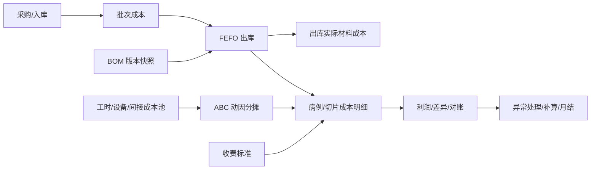

# ABC 前置模块产品目的验证报告

> 日期：2026-06-15
> 范围：从 ABC 成本法产品化倒推，检查主数据、采购入库、库存批次、BOM、项目、出库、对账、工时、设备、间接成本、异常库存操作等前置模块是否已经实现产品目的。
> 结论口径：不是检查“页面是否存在”，而是检查“是否能稳定产生成本核算需要的事实、规则和审计链”。

---

## 1. 总结论

当前系统的前置模块已经能支撑一部分库存业务和传统成本统计，但还不能直接支撑“基于 ABC 成本法的成本透明化产品”。

更准确地说：

1. **库存业务链条有骨架**：物料、入库、批次、出库、BOM、项目、盘点、报废等模块都有实现痕迹，部分关键操作已经有事务、库存流水和 FEFO 批次分配。
2. **成本核算事实不够稳**：物料价格、入库批次成本、出库实际成本、BOM 标准成本、人工/设备/间接成本、LIS 病例量之间还没有形成统一、可锁定、可重算、可审计的成本事实链。
3. **ABC 所需的“期间化”和“闭环化”缺失**：现有实现更像“业务发生时顺手写成本字段”，还不是“按月归集成本池、按动因分摊、异常补算、月末关账”的成本产品。
4. **当前主目录本身存在基线不一致**：`后端代码/server/src/app.ts` 已注册多个路由，但当前主目录缺少 `materials.ts`、`inventory-v1.1.ts`、`locations-v1.1.ts`、`returns-v1.1.ts`、`depletion-v1.1.ts`、`purchase-orders-v1.1.ts`、`supplier-returns-v1.1.ts`、`users-v1.1.ts`、`abc-v1.1.ts` 等文件；完整文件存在于 `.worktrees/master-aligned-integration-2026-06-15`。在没有统一代码基线前，不能把当前主目录视为可验证产品状态。

**一句话判断**：前置模块“局部可用”，但尚未实现 ABC 成本法产品化的前置产品目的；必须先做基线统一和成本事实链治理，再进入 ABC 页面/报表深度产品化。

---

## 2. 验证标准

本次按 ABC 产品目的倒推，前置模块必须提供 6 类能力。

| 能力 | 产品目的 | 不满足时的后果 |
|---|---|---|
| 主数据稳定 | 物料、供应商、项目、BOM、收费标准可作为核算维度 | 成本无法按正确对象归集 |
| 成本来源可信 | 入库价、批次价、退货/报废/盘点调整可追溯 | 出库成本、库存价值不可信 |
| 实际消耗真实 | 出库、BOM 出库、批次消耗能反映真实使用 | ABC 的材料成本和动因数量失真 |
| 标准消耗可版本化 | BOM 标准用量、标准人工/设备/间接成本可锁定历史版本 | 后续修改会污染历史成本 |
| 期间化成本池 | 工时、设备、间接费用按月份归集并有分摊口径 | 无法进行月度关账和环比分析 |
| 异常和审计闭环 | 失败、跳过、修正、重算、导出都有台账 | 财务无法解释差异，也无法复核 |

---

## 3. 模块达成度矩阵

| 模块 | 当前产品目的达成 | ABC 前置达成 | 判断 |
|---|---:|---:|---|
| 代码基线/模块注册 | 不满足 | 不满足 | P0 阻断 |
| 物料主数据 | 部分满足 | 部分满足 | 需要价格与引用完整性治理 |
| 分类/供应商/库位 | 基本满足库存目的 | 部分满足 | 维度可用，但不是成本维度治理 |
| 采购订单 | 部分满足 | 部分满足 | 能支持入库来源，但需严控超收/状态 |
| 入库管理 | 部分满足 | 部分满足 | 能生成批次和入库价，但需补数量/金额/PO一致性 |
| 库存与批次 | 部分满足 | 部分满足 | FEFO 有实现，但库存口径需统一 |
| BOM 管理 | 部分满足 | 部分满足 | 有标准成本字段，但历史版本和收费映射仍弱 |
| 项目管理 | 部分满足 | 不足 | 有项目归集，但缺病例/切片/收费锚点 |
| 出库管理 | 部分满足 | 部分满足 | 能写实际材料成本和部分 ABC，但异常处理不够产品化 |
| 退库/报废/盘点/供应商退货 | 部分满足 | 不足 | 能改库存，但未形成成本调整凭证 |
| 标准工时库 | 基本满足配置目的 | 部分满足 | 是标准值，不是实际工时事实 |
| 设备管理 | 部分满足 | 部分满足 | 有使用记录和折旧，但需统一口径和自动采集 |
| 间接成本中心 | 部分满足 | 部分满足 | 有月度分摊率，但缺关账/锁定/来源 |
| 成本对账/LIS | 部分满足 | 不足 | 有病例导入和差异计算雏形，但不是正式对账闭环 |
| 成本分析/ABC 报表 | 部分满足 | 不足 | 可展示部分聚合，仍有空实现/固定值 |

---

## 4. 关键阻断项

### P0-1：代码基线不一致

`后端代码/server/src/app.ts` 注册了 ABC、库存、物料、采购订单、退库、供应商退货等关键路由，但当前主目录缺少对应文件；这些文件在 `.worktrees/master-aligned-integration-2026-06-15` 中存在。

影响：

- 当前主目录无法作为“真实产品实现”验收。
- 文档、worktree、主目录三者状态不一致，容易让团队误判“已实现”。
- ABC 前置模块检查必须先明确验收基线，否则会出现同一模块在不同目录结论相反。

建议：

- 先定一个唯一验收基线：当前主目录、集成 worktree，或另一个 PR 分支。
- 将缺失路由和工具文件补齐或回滚注册，保证后端可启动、可测试。
- 后续所有产品目的验证只认这个基线。

### P0-2：成本事实没有统一事件台账

现在有 `stock_logs`，但它更偏库存流水，不足以承担财务成本台账。

ABC 需要的是“成本事件”：

- 入库：形成批次成本。
- 出库：形成实际材料消耗成本。
- 报废：形成损耗成本。
- 盘点：形成盘盈/盘亏调整。
- 供应商退货：形成采购成本冲减。
- 退库/撤销：形成反向成本事件。
- ABC 失败/跳过：形成待补算事件。

建议新增或强化 `cost_events` / `cost_exceptions`，让所有影响成本的动作都可重算、可审计。

### P0-3：BOM 标准成本和历史成本未完全隔离

BOM 路由已经有 `standard_labor_cost`、`standard_equipment_cost`、`standard_indirect_cost`、`standard_total_cost`、`fee_standard_id` 等字段，也会在创建/更新时计算标准成本。这是正确方向。

但当前版本管理更像“同一 BOM 行上的版本号递增”，不是完整的历史版本快照。若后续编辑 BOM 用量、收费标准、设备模板，历史出库单和历史利润分析可能被新标准污染。

建议：

- 出库时保存 `bom_snapshot_id` 或完整 BOM 成本快照。
- BOM 编辑新增版本记录，不覆盖历史版本的成本核算依据。
- 对账修正 BOM 用量时，必须区分“从下月生效”和“追溯重算”。

### P0-4：ABC 异常被吞掉，库存成功但成本失败

出库流程里，BOM 出库会尝试写 `outbound_abc_details`，但 ABC 计算失败时只打印错误，出库继续成功。

这个设计对仓库业务合理，因为不能让成本计算故障阻断发料；但对成本产品不够，因为财务后来不知道哪张出库缺 ABC 成本。

建议：

- ABC 失败时写入 `cost_exceptions`。
- 前端成本看板显示“待补算/失败/已补算”。
- 提供单笔和批量补算入口。

### P0-5：期间成本池没有关账状态

间接成本中心有月度分摊记录，ABC 成本池有 `year_month`，但缺少成本期间状态，例如 draft/open/closed/reopened。

影响：

- 月度报表会随着基础数据变化而漂移。
- 财务无法证明某月成本已经锁定。
- 重算没有边界，历史数据容易被当前配置污染。

建议：

- 建立 `cost_periods`。
- 月结后冻结成本池、动因率、BOM 快照、出库 ABC 明细。
- 关账后修改只能生成调整单，不能直接改历史事实。

---

## 5. 分模块验证

### 5.1 物料主数据

产品目的：作为库存和成本核算的最小物料维度，提供编码、分类、单位、供应商、参考价、库存和批次入口。

已实现证据：

- 物料列表关联分类、供应商、库位和库存。
- 创建物料时会自动创建 `inventory` 记录。
- 物料详情展示活跃批次和最近库存流水。
- 测试场景覆盖创建、编辑、删除、有库存不可删除、按分类/供应商筛选。

不足：

- 当前主目录缺少 `routes/materials.ts`，完整实现只在集成 worktree。
- `price` 是参考价，不是可靠成本价；真实成本应来自批次入库价。
- FRS 和测试场景都记录了负价格未由后端显式拦截、供应商 ID 不校验存在性、XSS 原样存储等问题。
- 修改分类后编码前缀不会同步，说明编码和分类维度不是强一致。

判断：库存目的部分满足；ABC 前置目的部分满足。物料能作为成本维度，但价格、供应商引用和数据质量还不够财务级。

建议：

- 后端强制 `price >= 0`，校验 `supplierId/categoryId/locationId` 存在。
- 区分“参考价”和“批次实际成本价”。
- 增加物料成本属性变更历史，避免历史报表口径漂移。

### 5.2 分类、供应商、库位

产品目的：提供物料归类、采购来源、库存位置等基础维度。

已实现证据：

- 物料路由使用分类、供应商、库位做关联展示和筛选。
- 供应商、分类、库位均有独立路由和前端模块。
- 物料编码按分类前缀生成，体现分类对业务编码有影响。

不足：

- 这些模块目前主要服务库存查询，不服务成本治理。
- 供应商维度没有形成采购价格历史、结算价格、返利/退款等成本依据。
- 库位维度没有参与仓储成本或作业成本分摊。

判断：库存目的基本满足；ABC 前置目的部分满足。它们可以做维度，但还不是成本维度。

建议：

- 供应商侧补“采购价历史/结算价/退货退款”。
- 库位如需进入 ABC，应明确是否承担仓储作业成本动因。

### 5.3 采购订单

产品目的：采购需求与入库来源，控制收货数量、供应商、价格和订单状态。

已实现证据：

- 入库路由会在关联采购订单时更新 `received_qty` 和状态。
- 交互规范和已有改动要求采购订单下拉支持 `pending,partial`。
- 测试已有采购订单场景。

不足：

- 当前主目录缺少 `purchase-orders-v1.1.ts`，完整实现只在集成 worktree。
- 历史待办记录中提到采购订单部分入库、超收、状态筛选等问题曾是关键缺陷。
- 如果采购订单价格和入库价格不一致，没有看到正式的差异处理流程。

判断：业务目的部分满足；ABC 前置目的部分满足。

建议：

- 明确采购订单价格、入库实际价格、发票结算价格三者的优先级。
- 超收入库必须后端拦截。
- 采购差异进入成本调整或采购差异台账。

### 5.4 入库管理

产品目的：库存增加入口，同时是批次成本的源头。

已实现证据：

- 入库创建会写 `inbound_records`、`batches`、`inventory`、`stock_logs`，并使用事务。
- 批次记录保存 `inbound_price`、供应商、生产日期、有效期。
- 取消、恢复、删除入库会尝试同步库存、批次和采购订单。

不足：

- 创建时仅校验 `type/materialId/quantity/locationId` 是否存在，没有明显看到 `quantity > 0` 和 `price >= 0` 的完整后端约束。
- 同批次追加入库时，现有批次的 `inbound_price` 如何处理不清楚；如果不同价格混入同一批次，成本价会失真。
- 当前库存流水是库存视角，不是成本凭证视角。
- 入库取消/删除会影响历史成本，需要更明确的成本冲销规则。

判断：库存目的部分满足；ABC 前置目的部分满足但存在 P0 风险。

建议：

- 强制数量、价格、批号规则。
- 同物料同批号不同价格时禁止混入，或拆分成本层。
- 入库取消/删除写入成本冲销事件，而不是只写库存流水。

### 5.5 库存与批次

产品目的：给出可用库存、批次效期、批次成本和出库分配依据。

已实现证据：

- `allocateBatches` 按 `expiry_date ASC, created_at ASC` 做 FEFO 分配。
- 分配结果携带 `batchId`、`batchNo`、`quantity`、`unitCost`，出库可以按批次实际成本计算。
- 品牌池分配 `allocateGroupBatches` 能跨同组物料按 FEFO 取批次。

不足：

- 当前主目录缺少 `inventory-v1.1.ts`。
- FRS 中库存口径曾出现“入库聚合”和“inventory 表”两种描述，必须统一。
- `locked_stock` 目前没有成为出库并发/占用的核心机制。
- 批次层的成本调整、盘亏、退货、报废没有统一成本分录。

判断：批次消耗的技术底座部分满足；财务库存成本目的不足。

建议：

- 统一库存数量的唯一事实源：`inventory.stock` 还是由批次余额汇总。
- 所有库存变化都必须同时更新批次余额、库存余额、成本事件。
- 建立批次成本余额表，支持盘点和供应商退货影响库存价值。

### 5.6 BOM 管理

产品目的：定义项目/检测项的标准物料、标准作业、标准成本和收费映射。

已实现证据：

- BOM 有 `bom_items`、版本号、物料用量、支持样本数。
- 创建/更新使用事务。
- 已引入标准人工、设备、质控、间接成本和收费字段。
- `fee_standard_id`、`standard_fee_per_slide`、`standard_margin_rate` 说明已经朝“成本 vs 收费”靠拢。

不足：

- 当前版本历史只是 `versionHistory: Current`，不是完整历史版本。
- BOM 更新会删除并重建 `bom_items`，如果没有快照，历史标准用量不可追溯。
- BOM-收费标准映射在方案中已经被识别为关键问题，仍需要典型业务验证。
- 对账修正可以直接更新 `bom_items.usage_per_sample`，若不分生效期，会污染历史。

判断：传统 BOM 目的部分满足；ABC 前置目的部分满足但必须补版本快照。

建议：

- BOM 版本表和 BOM item 版本表独立建模。
- 出库时保存 BOM 快照。
- 收费标准映射必须支持一对多、阶梯价、封顶、病例级聚合。

### 5.7 项目管理

产品目的：作为业务项目/检测项目维度，承接 BOM、出库和成本统计。

已实现证据：

- 项目可关联 `bom_id`。
- 项目详情统计出库总成本和单均成本。
- 删除项目时已经检查是否有关联出库记录。

不足：

- `docs/FRS/FRS-13-项目管理.md` 在当前文档目录缺失，但测试场景引用它，说明文档基线不完整。
- 项目当前更像“业务分类/检测项目”，不是“病例/切片/收费单元”。
- ABC 成本透明化需要病例号、切片数、蜡块数、收费项目、LIS 来源等更细粒度对象。

判断：项目维度部分满足；ABC 前置目的不足。

建议：

- 明确项目、BOM、病例、切片、收费项目之间的关系。
- 以病例/切片作为 ABC 核算明细对象，项目作为聚合维度。

### 5.8 出库管理

产品目的：记录实际消耗，是材料成本和 ABC 计算的业务触发点。

已实现证据：

- 普通出库和 BOM 出库使用事务。
- 出库按批次分配，写入 `outbound_items.unit_cost/total_cost`。
- BOM 出库会写 `outbound_abc_details`，并回写 `abc_total_cost`、`abc_activity_cost`、`fee_amount`、`profit`。
- 取消出库会回滚库存并删除 ABC 明细。

不足：

- BOM 出库部分物料失败会进入 `skippedItems`，但如果业务允许“跳过材料仍完成出库”，成本会低估。
- ABC 计算失败不阻断出库，也没有成本异常台账。
- `sampleCount`、`slideCount`、`blockCount` 等 ABC 动因如果来自用户输入或默认值，需要更强来源约束。

判断：库存消耗目的部分满足；ABC 前置目的部分满足但需异常闭环。

建议：

- 区分“库存允许继续”和“成本必须补算”。
- 任何 `skippedItems` 或 ABC 失败都写异常台账。
- 出库完成时保存 BOM、收费、成本池动因快照。

### 5.9 退库、报废、盘点、供应商退货

产品目的：处理非正常库存变动，保证库存和成本不被异常业务扭曲。

已实现证据：

- 报废、盘点、供应商退货等路由均有库存检查、事务、库存流水。
- 盘点支持差异调整和撤销。
- 报废和退货能写反向流水。

不足：

- 这些操作当前主要修改 `inventory.stock`，没有看到统一的批次成本冲销/调整逻辑。
- 供应商退货创建时批次字段传入为 `null` 的迹象明显，批次成本追溯不足。
- 退库命名与业务语义需要澄清：当前 `returns-v1.1.ts` 看起来是从库存扣减，而验收标准里“退库成本 = 追溯原出库单价”更像“科室退回仓库/退料入库”。

判断：库存异常处理部分满足；ABC 成本前置目的不足。

建议：

- 对每类异常定义成本方向：增加库存、减少库存、冲减成本、计入损耗。
- 供应商退货必须绑定批次或入库记录。
- 盘盈盘亏必须生成成本调整事件。

### 5.10 标准工时库

产品目的：定义各作业步骤的标准分钟数和人工费率，为标准成本和 ABC 动因提供基础。

已实现证据：

- 有 `standard_labor_times` CRUD。
- 字段包含 `project_type`、`standard_minutes`、`labor_rate_per_minute`、`is_equipment_step`。
- BOM 标准成本计算会读取标准工时。

不足：

- 这是标准工时，不是实际工时。
- 没有期间版本、生效日期、审批状态。
- 人工费率如何来自工资/成本池不清楚。

判断：配置目的基本满足；ABC 前置目的部分满足。

建议：

- 增加标准工时版本和生效期。
- 区分标准成本和实际成本：标准工时用于预算/差异，实际工时或成本池用于实际分摊。

### 5.11 设备管理

产品目的：管理设备资产、使用记录和折旧成本。

已实现证据：

- 设备有采购价、残值、折旧年限、折旧方法。
- 有设备使用记录，能关联项目和出库。
- 集成 worktree 中设备折旧统计与成本计算器口径有对齐意图。

不足：

- 历史待办明确记录过“设备折旧公式错误（差 4.38 倍）”，需要以最终基线再跑测试确认。
- 设备使用记录需要人工录入，尚未和实际检验流程自动绑定。
- BOM 设备模板、设备使用记录、ABC 成本池之间的关系还不清晰：是按标准模板计，还是按实际使用计。

判断：资产管理目的部分满足；ABC 前置目的部分满足。

建议：

- 固化统一折旧函数，并用测试覆盖年、月、分钟三个口径。
- 出库/BOM 完成时自动生成或提示补录设备使用。
- 月结时设备折旧进入设备作业成本池。

### 5.12 间接成本中心

产品目的：录入和分摊无法直接归属到单个项目/切片的成本。

已实现证据：

- 间接成本中心支持成本类型、月金额、分摊基础。
- 有月度 allocation，记录 `totalAmount`、`allocationBaseValue`、`allocationRate`。
- BOM 标准成本和成本计算器会读取间接成本分摊率。

不足：

- 成本来源偏手工录入，缺少审批、附件、来源凭证。
- 没有关账状态，历史月份仍可能被改。
- 分摊基础值由用户输入，缺少和 LIS/出库/样本数的自动校验。

判断：配置目的部分满足；ABC 成本池目的部分满足但未闭环。

建议：

- 间接成本中心并入 ABC 成本池归集流程。
- 分摊基础自动从业务事实计算，手工值只能作为调整。
- 月结后锁定。

### 5.13 成本对账 / LIS 病例导入

产品目的：把真实病例量和实际消耗对齐，发现 BOM 标准用量、出库消耗、项目映射的问题。

已实现证据：

- 对账路由支持 LIS 病例统计、病例导入、按项目/物料比较理论消耗和实际出库。
- 对账修正日志可以记录 old/new/reason/operator。
- 可通过项目 BOM 计算理论用量。

不足：

- 对账导出在待办中仍是空实现。
- 对账修正直接改 `bom_items`，如果没有生效期和版本策略，会污染历史。
- LIS 导入的 project_id 验证曾被列为问题，说明病例和项目映射不稳。
- 对账结果没有进入成本异常、补算、关账流程。

判断：对账雏形存在；ABC 前置目的不足。

建议：

- 对账差异进入 `cost_exceptions`，形成处理状态。
- 修正 BOM 时要求选择“仅未来生效/追溯重算”。
- 对账导出必须真实实现，用于财务复核。

### 5.14 成本分析和 ABC 报表

产品目的：让财务看到成本、收费、利润、差异、异常，并能下钻解释。

已实现证据：

- 传统成本分析能按出库记录聚合材料成本，并补人工、设备、间接字段。
- ABC dashboard 能汇总 `outbound_abc_details` 的成本、收费、利润。
- 盈利性和切片成本接口已有初步数据结构。

不足：

- ABC dashboard 的 `costChange/feeChange/profitChange` 固定为 0，`costByActivity` 为空。
- `variance-analysis` 返回空结构。
- 批次追溯、导出、告警等能力仍弱。
- 传统成本分析和 ABC 报表可能使用不同口径，必须统一“成本入口函数”。

判断：展示目的部分满足；成本透明化目的不足。

建议：

- 所有成本页面统一读取成本快照/成本事件，而不是各算各的。
- dashboard 必须显示异常数、待补算数、关账状态。
- 每个利润数字都可下钻到出库、BOM 快照、批次、成本池、收费标准。

---

## 6. 推荐修复顺序

### 第一批：先把地基找齐

1. 统一代码基线，补齐或回滚缺失路由。
2. 跑后端启动、类型检查、核心 API 测试，确认验收对象唯一。
3. 写一份“成本事实源说明”：库存数量、批次成本、BOM 标准、ABC 实际成本分别以哪些表为准。

### 第二批：打通成本事件链

1. 定义 `cost_events` 和 `cost_exceptions`。
2. 入库、出库、报废、盘点、供应商退货、退库全部写成本事件。
3. ABC 失败/跳过/缺配置不再只打印日志，必须进入异常台账。

### 第三批：版本与期间

1. 建立 BOM 版本快照。
2. 建立 `cost_periods`，支持 open/closed/reopened。
3. 月结后冻结成本池、动因率、出库 ABC 明细和报表快照。

### 第四批：对账闭环

1. LIS 导入校验项目/BOM 映射。
2. 对账差异生成异常处理单。
3. 修正动作选择生效范围：未来生效或追溯重算。
4. 导出真实可用。

### 第五批：产品界面收口

1. 财务首页显示：本月成本、收费、利润、异常数、待补算数、关账状态。
2. 出库详情显示：材料批次成本 + ABC 作业成本 + 收费标准 + 利润。
3. BOM 页面显示：标准成本、收费映射、版本差异、是否影响历史。

---

## 7. 对产品经理的判断建议

如果目标只是“库存管理 + 粗略成本报表”，现有前置模块可以继续修补上线。

如果目标是“ABC 成本法产品化”，不要急着继续做更多报表页。现在最该做的是把前置模块收敛成一条可靠的成本生产线：

当前最值得投入的不是“再设计一版 ABC 看板”，而是先让每个数字都有来源、有版本、有期间、有异常处理。

---

## 8. 本次检查使用的主要证据

| 类型 | 文件 |
|---|---|
| 产品目标 | `docs/02_PRD.md`、`docs/07_Acceptance_Criteria.md` |
| 数据对象 | `docs/06_Data_Object_List.md` |
| 业务规则 | `docs/04_Business_Rules.md`、`docs/13_Decision_Log.md` |
| 已知问题 | `docs/09_Task_Backlog.md`、`plans/abc-product-purpose-verification.md` |
| ABC 修订结论 | `plans/abc-final-verification-v3.md`、`docs/ABC成本核算产品化诊断与重构建议.md` |
| 当前主目录代码 | `后端代码/server/src/app.ts`、`后端代码/server/src/routes/*`、`后端代码/server/src/utils/allocation.ts` |
| 集成 worktree 代码 | `.worktrees/master-aligned-integration-2026-06-15/后端代码/server/src/routes/*`、`.worktrees/master-aligned-integration-2026-06-15/后端代码/server/src/utils/cost-calculator.ts` |
| 测试场景 | `docs/TestScenarios/TS-06-物料管理.md`、`TS-07-库存管理.md`、`TS-08-入库管理.md`、`TS-09-出库管理.md`、`TS-12-BOM管理.md`、`TS-13-项目管理.md`、`TS-14-成本分析.md` |
